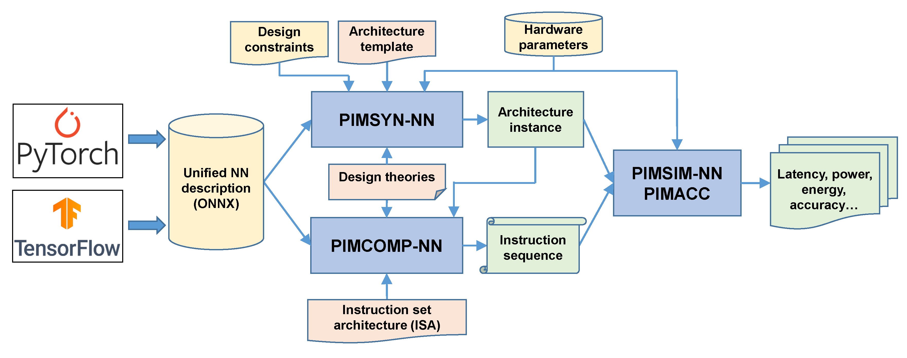

# PIM EDA Suite
Architecture-level EDA toolchain for processing-in-memory convolutional neural network accelerators.

## Introduction
PIM toolchain is suite of open-source tools designed for processing-in-memory architectures running convolutional neural networks. The framework of the toolchain is shown below.

The toolchain has three main tools, including an architecture synthesizer, a compiler, and a simulator.

+ The **synthesizer (PIMSYN-NN)** takes a neural network description (ONNX format) and design constraints as inputs, and generates an architecture instance based on a parameterized architecture template. Design space exploration is performed during the synthesis process to optimize the architecture. 

+ The **compiler (PIMCOMP-NN)** takes the neural network description and the architecture instance as inputs, and generates the instruction sequence together with optimized task mapping and scheduling. The instructions are based on a defined [instruction set architecture](https://arxiv.org/abs/2308.06449).

+ The **simulator (PIMSIM-NN)** takes the architecture and the instruction sequence as inputs, and performs a behavior-level simulation to get the NN inference performance results of the latency, power, energy, etc.

## Tools' Links

[Compiler (PIMCOMP-NN)](https://github.com/sunxt99/PIMCOMP-NN)

[Architecture Synthesizer (PIMSYN-NN)](https://github.com/lixixi-jook/PIMSYN-NN)

[Simulator (PIMSIM-NN)](https://github.com/wangxy-2000/pimsim-nn)

## Related Publications

[1] Xiaotian Sun, Xinyu Wang, Wanqian Li, Lei Wang, Yinhe Han, Xiaoming Chen, ["PIMCOMP: A Universal Compilation Framework for Crossbar-based PIM DNN Accelerators"](https://ieeexplore.ieee.org/document/10247928), in Design Automation Conference (DAC'23), 2023.  [[Bibtex](https://github.com/chenxm1986/PIM-Toolchain/blob/main/papers/bibtex.txt)] [[ArXiv](https://arxiv.org/abs/2307.01475)]

[2] Wanqian Li, Xiaotian Sun, Xinyu Wang, Lei Wang, Yinhe Han, Xiaoming Chen, ["PIMSYN: Synthesizing Processing-in-memory CNN Accelerators"](https://github.com/chenxm1986/PIM-Toolchain/tree/main/papers/pimsyn-nn.pdf), in Design, Automation and Test in Europe Conference (DATE'24), 2024. [[Bibtex](https://github.com/chenxm1986/PIM-Toolchain/blob/main/papers/bibtex.txt)] [[ArXiv](https://arxiv.org/abs/2402.18114)]

[3] Xinyu Wang, Xiaotian Sun, Yinhe Han, Xiaoming Chen, ["PIMSIM-NN: An ISA-based Simulation Framework for Processing-in-Memory Accelerators"](https://github.com/chenxm1986/PIM-Toolchain/tree/main/papers/pimsim-nn.pdf), in Design, Automation and Test in Europe Conference (DATE'24), 2024.  [[Bibtex](https://github.com/chenxm1986/PIM-Toolchain/blob/main/papers/bibtex.txt)] [[ArXiv](https://arxiv.org/abs/2402.18089)]

[4] Wanqian Li, Yinhe Han, Xiaoming Chen, [“Mathematical Framework for Optimizing Crossbar Allocation for ReRAM-based CNN Accelerators”](https://dl.acm.org/doi/full/10.1145/3631523), ACM Transactions on Design Automation of Electronic Systems (ACM TODAES), vol. 29, no. 1, pp. 1-24, 2024. [[Bibtex](https://github.com/chenxm1986/PIM-Toolchain/blob/main/papers/bibtex.txt)]
